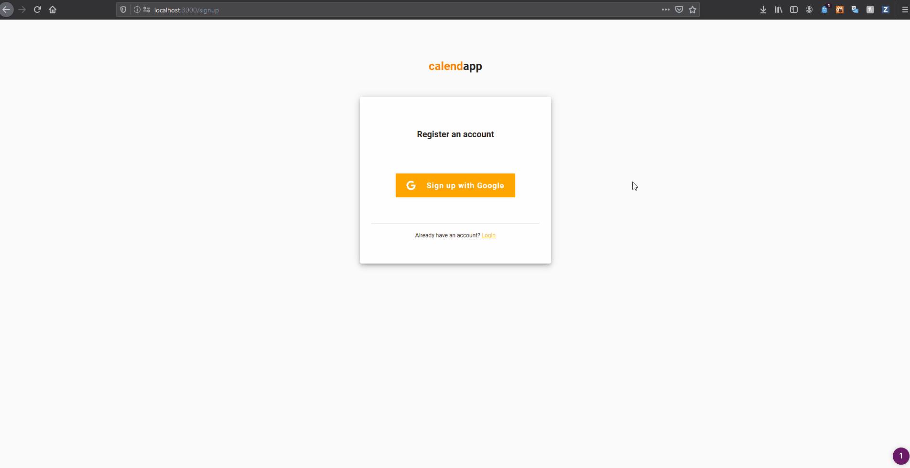
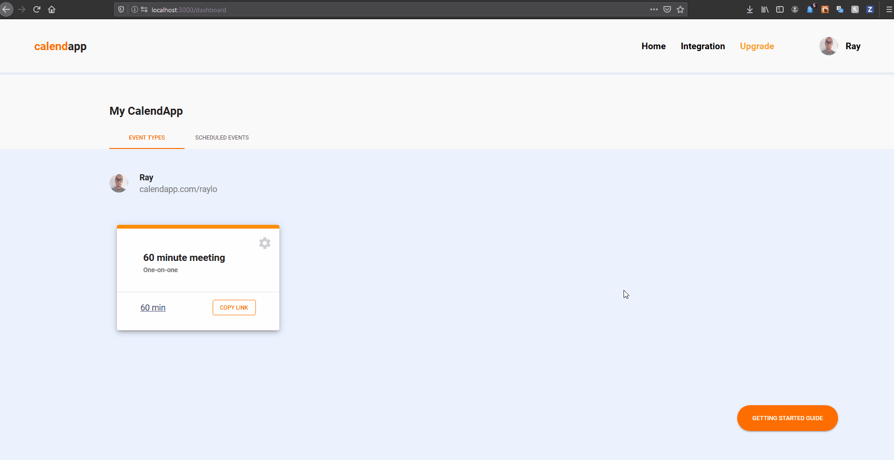
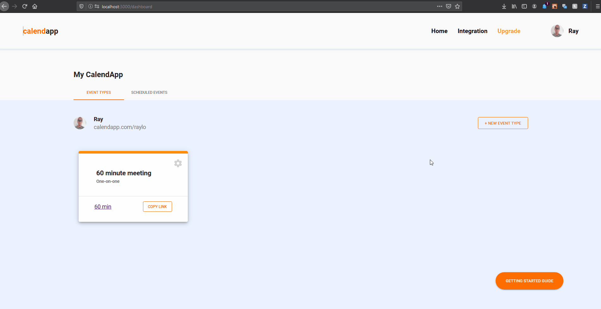
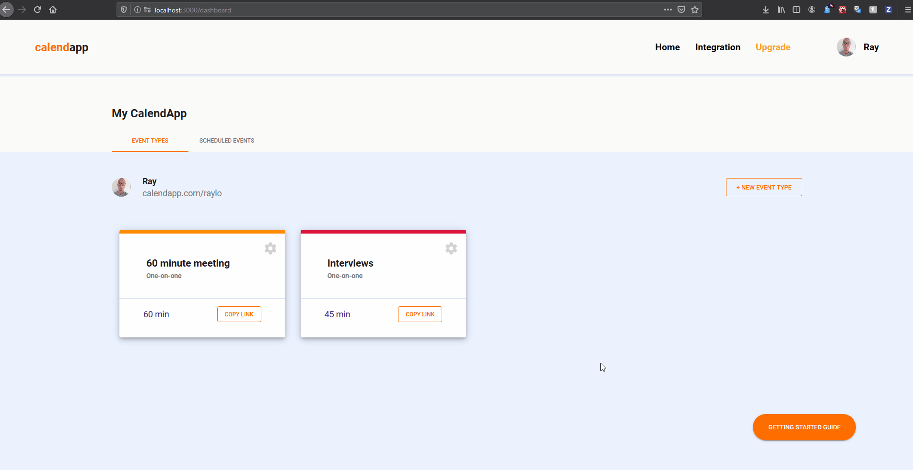

## Calendapp

Calendapp is a web application inspired by Calendly to allow users to schedule meetings more easily. We also utilize Google Calendar API to ensure there are no conflicts in your schedule.

Now deployed on heroku at [calendappy.herokuapp.com](https://calendappy.herokuapp.com)

**Tech Stack:** MongoDB, Express.js, React.js, Node.js

**Contributors**: [Raymond Lo](https://github.com/rayy-lo), [Jenny Kam](https://github.com/jk-me)

---

### Getting Started

1. Clone or download repository

2. Run `npm i` in both `client` and root directories to install packages

3. Create your API Keys and .env files - **See [client](https://github.com/hatchways/team-carbonara/blob/dev/client/sample.env) and [server](https://github.com/hatchways/team-carbonara/blob/dev/sample.env) `sample.env` for more instructions**
   - client/.env file
   - .env file
4. To start the two processes, run `npm start` in the client directory, and `npm run dev` in the root directory

---

### Demo

1. Login or Register with your Google Account. As a new user you will enter your availability to be scheduled for meetings (ex.9am-5pm, Mon-Fri) and to create a unique url to be shared with potential meeting attendees.

2. Share the unique link for a meeting type with others so they can schedule an appointment.

3. People who want to meet with you will be able to schedule an appointment. Appointments will be added to the invitee's and your google calendar, and an email notice will be sent to you.

---

### Extra Features

1. Subscribing will allow users to create multiple event types, in addition to the default 60 minute meeting.

2. Create new meeting types after subscription

3. Cancel appointments. The event will also be removed from your google calendar and guests will be notified.

